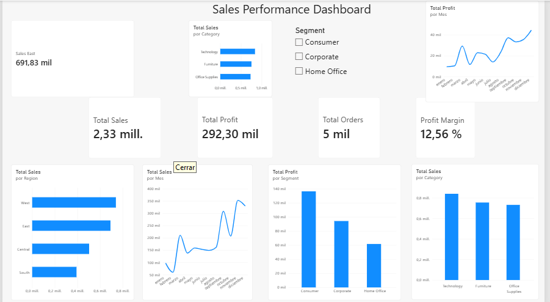

# Superstore Sales & Profitability Analysis

Retail sales and profitability analysis using Excel, SQL and Power BI.

## Project Overview

This project analyzes retail sales and profitability data to identify business performance trends, top-performing products, regional performance, and products with negative profitability.

## Business Problem

The company wants to better understand its sales and profitability performance and identify areas that may require business attention.

The analysis aims to answer the following questions:

- Which categories generate the most sales and profit?
- Which regions perform best?
- Which products generate the highest sales?
- Are there products with high sales but negative profitability?
- How do sales and profit change over time?

## Dataset

The dataset contains retail sales data, including information about orders, customers, products, regions, sales, discounts, quantities, profits, and returns.

The analysis uses three main tables:

- `Orders`: the main table containing order, product, sales, and profitability information.
- `People`: additional information related to regional management.
- `Returns`: information about returned orders.

## Data Cleaning

Data preparation was performed using Power Query in Power BI.

The main data cleaning steps included:

- Correcting column headers.
- Assigning appropriate data types to each field.
- Converting `Order Date` to a date format.
- Checking for missing values in key columns.
- Validating the data before building the analysis and dashboard.

## Analysis Approach

The project combines Excel, SQL, and Power BI for data preparation, analysis, visualization, and business insights.

SQL was used to perform additional business analysis on the Superstore dataset, including:

- Category performance.
- Product profitability.
- Discount vs. profitability.
- Top customers by sales.
- Product ranking within each category.

## Power BI Analysis

Power BI was used to build an interactive dashboard and analyze business performance.

The dashboard includes:

- Total Sales
- Total Profit
- Total Orders
- Profit Margin
- Sales by Region
- Sales by Month
- Sales by Category
- Profit by Segment
- Profit by Month

Additional product analysis was performed using:

- Top 10 Products by Sales
- Products with Negative Profit
## Power BI Dashboard

## Key Insights

### Category performance

Technology generated the highest sales and profit among the three categories, while Furniture generated significantly lower profit despite having substantial sales.

### Top-performing product

The Canon imageCLASS 2200 Advanced Copier was the highest-selling product among the Top 10 products analyzed, generating approximately 61,600 in sales and 25,200 in profit.

### Products with negative profitability

Several products generated significant sales but negative profit, showing that high sales do not necessarily translate into profitability.

### Discount and profitability

Higher discount levels were associated with lower profitability in the dataset. Discount levels of 30% or more showed negative total profit.

### Customer profitability

Sean Miller was the highest-selling customer, generating approximately 25,043 in sales but a negative profit of approximately -1,981.

### Main business insight

Sales performance should be evaluated together with profitability. High sales alone do not guarantee that a product or customer is financially valuable to the business.

## Business Recommendations

Based on the analysis, the following areas should be investigated:

- Review pricing strategies for products with negative profitability.
- Analyze the impact of discounts on product margins.
- Investigate product-level costs and profitability.
- Monitor both sales and profit when evaluating product performance.

## Tools

- Excel
- SQL
- Power Query
- Power BI
- DAX
